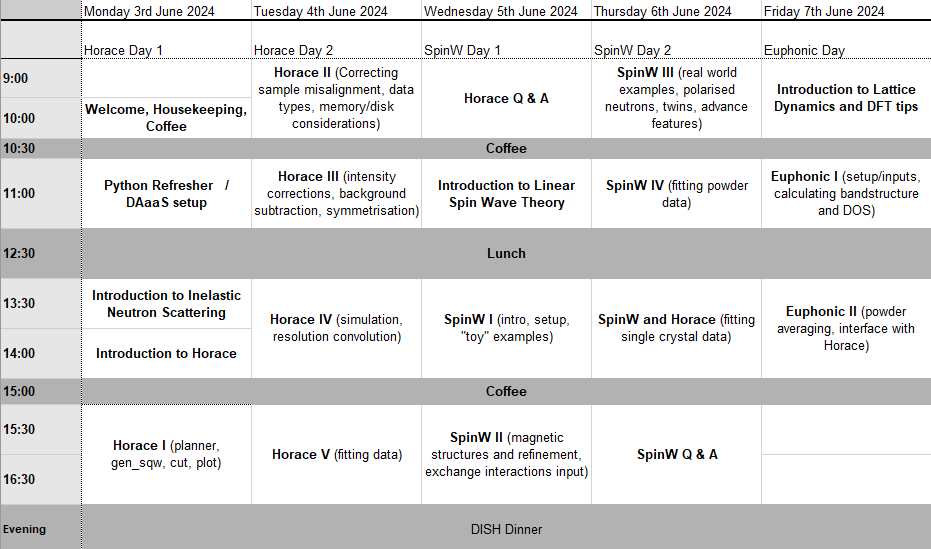

# Excitations Data Analysis Training Workshop Data

This repository contains presentations, data and Jupyter notebooks used during the Excitations training workshop held at RAL from 3-7 June 2024.

---

 Excitations Data Analysis Training Workshop Materials by <a xmlns:cc="http://creativecommons.org/ns#" href="https://github.com/mducle/edatw24" property="cc:attributionName" rel="cc:attributionURL">M. D. Le and others</a> is licensed under a <a rel="license" href="http://creativecommons.org/licenses/by-sa/4.0/">Creative Commons Attribution-ShareAlike 4.0 International License</a>. Based on a work at <a xmlns:dct="http://purl.org/dc/terms/" href="https://github.com/mducle/edatw24" rel="dct:source">https://github.com/mducle/edatw24</a>.
